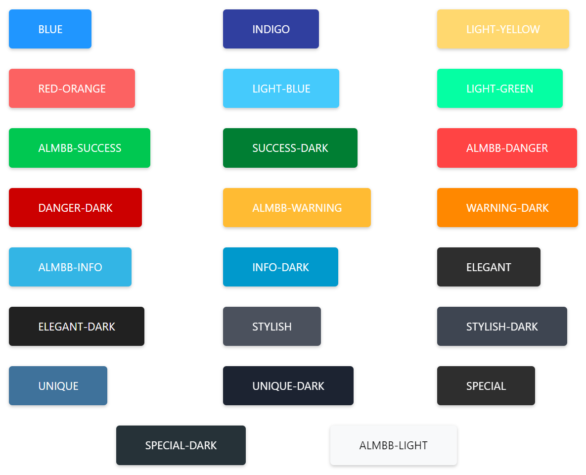

# Colors

* blue
* indigo
* light-yellow
* red-orange
* light-blue
* light-green
* almbb-success
* success-dark
* almbb-danger
* danger-dark
* almbb-warning
* warning-dark
* almbb-info
* info-dark
* elegant
* elegant-dark
* stylish
* stylish-dark
* unique
* unique-dark
* special
* special-dark
* almbb-light

